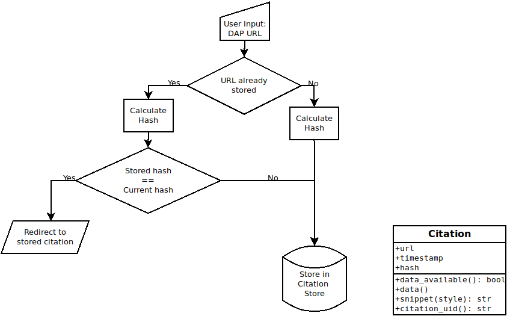
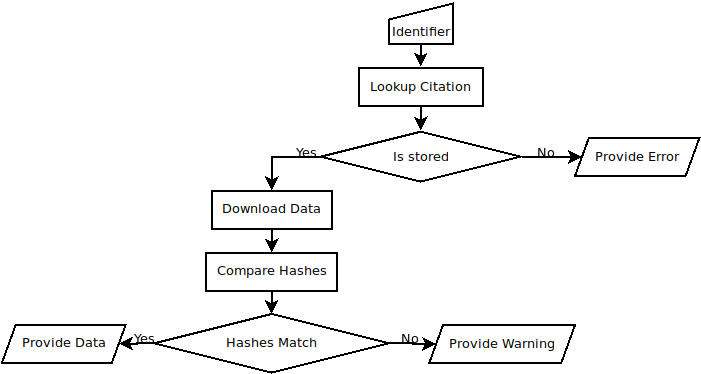
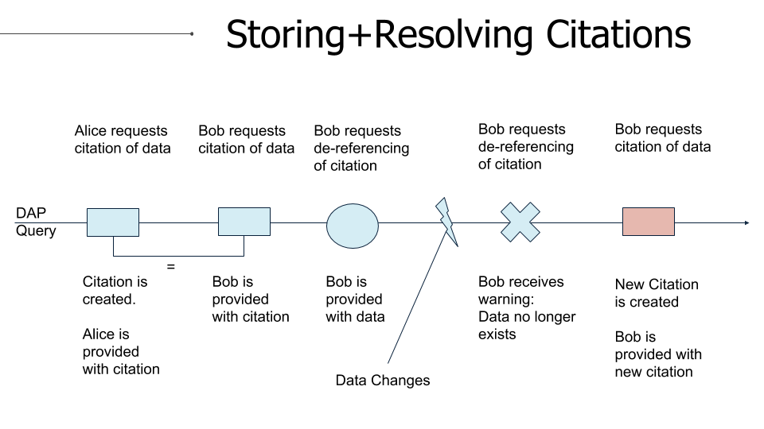
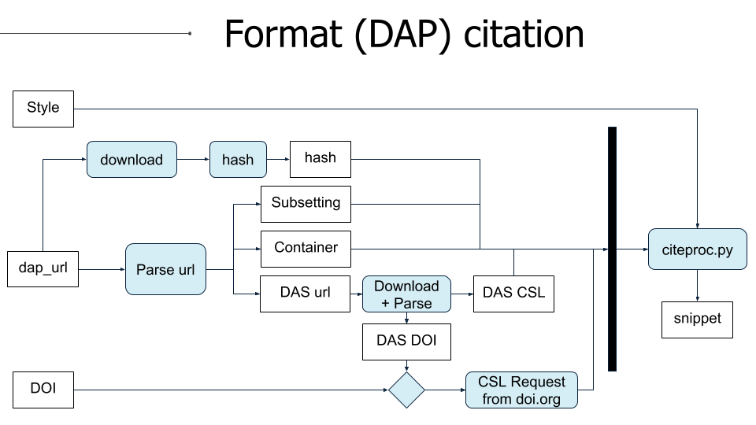
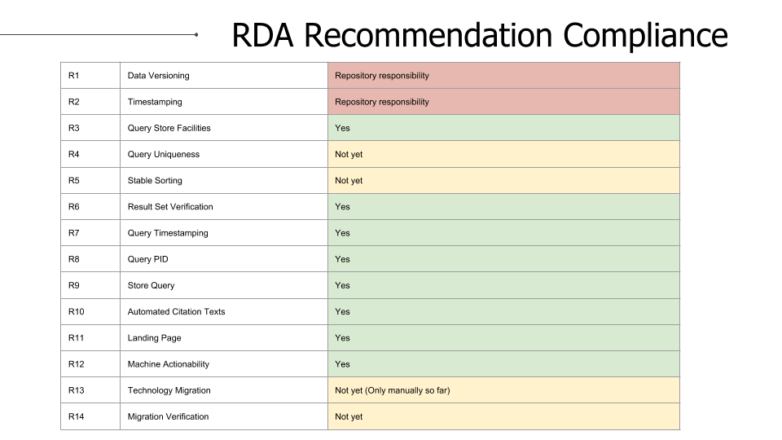

# OCCUR: An automated data citation system for OPeNDAP resources

Niklas Griessbaum

James Frew

**CONTENTS**

- TOC
{:toc}
## Abstract

[TBD]

## Introduction

### Why Data citations

[@Hey2009] coin the term *4th paradigm* as “using computers to gain understanding from data created and stored in our electronic data stores [..]”. The 4th paradigm arises from an environment in which large amounts of data are collected 24/7 and made publicly accessible.  Research is not anymore just driven by empirical, theoretical and computational approaches, but also by the exploration of vast amounts of data collected from instruments and simulations. In this context, data collection and assembly itself is a significant research activity [@Frew2012].

A crucial step into the 4th paradigm is the acknowledgments of data as first class research products. As such, they have to be persistently available, documented, citable, reusable, and possibly peer-reviewed [@Callaghan2012, Kratz2014]. Consequently, the research community has to move from data sharing to data publishing [@Costello2009, Kratz2014] or, in other words, has to make data <abbr>FAIR</abbr> [@Wilkinson2016]. Data citation are one of the required building blocks to achieve this goal and a common adaption of data citations is expected to benefit the progress of science [@CODATA2013].

However, there does not seem to be a consensus on what data publication means [@Kratz2014] and how data citation mechanisms, which would sufficiently motivate throughout adaption of data publishing, are to be implemented [@Costello2009]. The lack of data citation standards was already criticized more than a decade ago by [@AltKin07]. The authors proposed a set of standards to address the issues. But years later, [@Altman2015] as well as [@Tenopir2011] find that even though required by publishers, researchers still too often do not make data publicly available, nor cite the data consequently. We may find both cultural and technical reasons for this:

[@Lawrence2011] find that traditionally only conclusions are judged.  Only little attention is given to the fitness of the used data for re-interpretation. This in turn results in low appreciation for data production and publishing. Even more so, [@Tenopir2011] stress out that researchers may actually be motivated to purposefully withhold data in order to retain their own ability to publish findings.

On the technical side, robustness, openness, and uniformity in data publication are lacking [@Starr2015, Koltay2016]. Cost, not so much for the storage, but for curation efforts is another reason preventing data publication [@Gray2002]. [@Tenopir2011] states that a major reason for data withholding is the effort required to publish data.  Additionally, [@Belter2014] finds that even when used, data citation practices are inconsistent. illustrates the range of practices which span from exporting a formatted citation string or a generic format such as RIS or BibTex, to embedded links to the dataset, or sharing to social media.

[@Silvello2017] provides an exhaustive review of the current state of data citations in terms of reasons for the necessity of data citations and on current examples of data citation implementations. Based on a meta-study, the author identified 6 main motivations for data citations: Attribution, Connection, Discovery, Sharing, Impact, Reproducability.  Arguably, these motivations can be condensed to Identity, Attribution, and Access:

##### Identity:

Citations provide an identity, enabling to reference and reason about data [@Bandrowski2016], even if it does no longer exist or is behind paywalls. Distiguishing and uniquely identifying data also allows to evaluate its usage and hence its relevance and impact [@Honor2016].

##### Attribution:

Citations attribute data to authors and therfore allow to give credit.  The possibility to receive credit in term provides an incentive for sharing [@Niemeyer2016, Callaghan2012, Kratz2014].

##### Access:

A citation provides information on how to retrieve the cited material (e.g. the journal, year and pages). Persistent access to data is crucial since it is the foundation of reusability and reproducability [@Starr2015].

Data citations may provide an additional side-effect improving data accessibility: There is evidence suggesting that well curated data will be cited favorably [@Belter2014]. Citations therefore may be a motivating driver for researchers to sustainably curate their data and thus making them more accessible.

### What is data citation?

Citations provide identity, attribution, and access mechanisms to cited material. Data citations differ from citations of printed material in that the cited content (i.e. the data) may evolve over time and in that meta-information such as authorship or the provenance may vary within a continuous dataset [@Buneman2016]. Further, since generally speaking, data can be subset in infinite ways, data citations cannot be statically generated. This is specifically true in scenarios in which data, rather than files, are accessed through APIs[^2]. Data citations therefore have to be machine-actionable, both in terms of dynamic creation (as a function of time and subsetting parameters) and in terms of resolving citations to the cited material [@Assante2016, Altman2015, Buneman2016].

Data citations often utilize actionable <abbr>PID</abbr> such as <abbr>DOIs</abbr> to enable actionability. However, since actionable <abbr>PIDs</abbr> provide identity and access mechanism at the same time, they blur the discussions about identity and access [@ESIP2012a]. In this context, [@Buneman2010] empathize that <abbr>DOIs</abbr> should be considered a part of, but not a substitute for data citations.  Identity and access remain two distinct facets of a citation and there is utility in data identity regardless of whether or not the data can be accessed or even still exists. criticizes another aspect of <abbr>DOI</abbr> use in data citations: <abbr>DOIs</abbr> are misunderstood to provide imprimaturs and persistence. However, <abbr>DOIs</abbr> cannot provide persistence and should solely be understood as a locator and identifier, which are required long before an imprimatur can be issued.

We want to discuss the following aspects of data citations in detail:

1. How are datasets and their subsets identified?

2. How is fixity is assured?

3. How are revisable datasets handled?

4. How do citations facilitate access to data?

5. How are human readable citation snippets/strings generated.

The way these aspects are solved depend widely on the domain and the particular dataset characteristics in terms of data complexity (table/arrays vs graphs), data volume (k vs P), as well as update frequency and the characteristics of the repository in terms of subsetting capabilities and the typical use.

##### Identity:

A unique identity can be represented by any arbitrary string, given that it is unique [@CODATA2013]. In some contexts, filenames [@Buneman2016], or already established identifiers such as accession numbers [@Bandrowski2016] may serve this purpose. In practical terms, [@AltKin07] suggest that the identity should double as a handle to the data by associating it with a naming resolution service, e.g. through the use of e.g. <abbr>DOI</abbr>, <abbr>LSID</abbr>, <abbr>URN</abbr>, <abbr>HNR</abbr>[^3], or <abbr>URL</abbr>.

In contrary to traditional publications, data may be queried to produce an infinite number of subsets from a single source [@Davidson2017, CODATA2013]. It is therefore not only necessary to reference a dataset, but every possible subset of a dataset. [@AltKin07] coin the term “deep citation” to describe the ability to reference subsets of data.  Further, data may evolve over time, which opens discussion of how to identify the varying states of a datset [@Huber2015].

This further prompts the question of at which granularity a unique identity, and hence a <abbr>PID</abbr> should be minted.  [@Buneman2010] herefore introduce the concept of a “citable unit”. A citable unit is an object of interest which could be e.g. a fact stated in a scientific paper, or a subset within a dataset. The authors argue against creating identifiers for every object of interest, but rather to wisely choose the granularity of the citable unit. A citation of an object can then be created by appending the identity of the citable unit with information about the location of the object within the citable unit. In relational databases, for example, citable units could be defined through views [@Buneman2016].

[@Rauber2015] and [@Proll2013] as well as the <abbr>RDA</abbr> <abbr>WGDC</abbr> [@Rauber2015a] on the other side suggests to identify subsets by storing (normalized) queries and associating them with a <abbr>PID</abbr>. Since methods and syntax for subsetting depend on the individual repository technology, [@AltKin07] hereby suggest to cite the entire dataset and append it with a textual description of how the dataset was subsetted.  The authors further suggest that if significant pre-processing is done on the dataset, it should be stored and cited with its own identity individually.

##### Fixity:

Datasets may change unintentionally through data rot or malicious manipulation, or intentionally, due to <abbr>CUD</abbr> operations. Data fixity is the property of data to remain unchanged. Fixity checking allows to verify that data has not changed. If included into a data citation system, fixity checking can be used to verify if some data equals the referenced data.

[@AltKin07, Rauber2015, Crosas2011] suggest to include <abbr>UNFs</abbr> into data citations to allow fixity checking. Though mentioned in most papers addressing data citation systems (e.g. [@Buneman2016, Davidson2017]), only few data citation system implementations have addressed fixity so far. In this context, [@Klump2016] report that the STD-DOI[^4] metadata schema rejected the inclusion of <abbr>UNFs</abbr> as they would be dependent on
the form of representation (e.g. file formats or character encoding).

##### Revisability:

Datasets may evolve over time through updates, appendation, or deletion [@Klump2016]. In the following, we will refer to these datasets as *revisable data* to delimit the term from datasets changing over time due to malicious manipulation or through data rot.

Literature frequently intermixes the term “fixity” and the ability to cite revisable datasets. A revisable dataset is anticipated and intended to change its *state* over time. A citation system consequently has be able to distinguish between the states of a revisable dataset [@Rauber2015, Klump2016]. However, to achieve this, merely the abstract state a citation is referencing has to remain fixed (i.e. there cannot be ambiguity of the referenced state). This is true independently of the ability to de-reference a citation to the referenced state (i.e.  the actual state being fixed). Identifying and referencing an ephemeral state of a dataset is a necessary requirement for data citation. The ability to persistently retrieve this state of the data is a data publication, not data citation challenge. It hereby is up to the publisher and repository to choose an apt level of zeal:

Pessimistic  

Data is assumed to be ephemeral and consequently citations cannot ever be de-referenced.

Optimistic  

Data is assumed to be fixed. Citations always de-reference to the current state of the data.

Opportunistic  

Data is assumed to remained fixed for some time. Citations can be de-referenced only until the data changes.

Pedantic  

Every state of the data is saved. Consequently citations can always be de-referenced to the referenced state.

[@Klump2016] make a hard distinguishing between growing, and updated dataset. Retrieving any state of a growing dataset can simply be implemented through time ranges, given that records are timestamped.

Versioning can be used to identify states of revisable data. We acknowledge that the term *version* is often used synonymously with the term *state* (of a dataset or a single record). However, in the following, we will use the term *version* as a policy-prescribed reference to a state.

Versioning is intuitive and can trivially be implemented e.g. by appending version number suffixes to dataset names[^5]. However, since versioning is merely a *policy*, there is no guarantee for enforcement.  Further, “There is currently no agreed standard or recommendation among data communities as to why, how and when data should be versioned”[^6].  The W3C[^7] provides some guidance on how revisable data should be handled on the web, however, <abbr>RDA</abbr>[^8] considers theses standards too simple and not scalable.

A concern in data versioning is how to reach “consensus about when changes to a dataset should cause it to be considered a different dataset altogether rather than a new version”[^9]. From a pure identity perspective, this question is futile since every relevant state needs to be identifiable. The distinguishing between version versus state therefore is mainly connected to the nature of <abbr>PIDs</abbr> (and the costs associated with minting them) [@Klump2016] as well as the notion of hierarchical association and provenance.

As mentioned above, it is open for debate whether or not reproducability is a hard requirement for data citations of a revisable dataset. If not, resolving of citations could be deprecated altogether (pessimistic), or only allowed until the data has changed (opportunistic). The opportunistic approach could e.g. be implemented by timestamping modifications (last modification date) or through fixity checking. The <abbr>RDA</abbr> <abbr>WGDC</abbr> [@Rauber2015] elaborates on this approach: A dataset (or a subset) should be given a new identity when the data has changed since the last time the dataset (or subset) was requested. This is recommended to be implemented through the use of a normalized query store and checksums [@Ball2015].

[@Gray2002] advocate for all non-regeneratable data to remain available forever and [@Buneman2010] suggest a dataset to remain accessible once it has been cited. In their implementation, a citation can include a version number, allowing the system to de-refrence a citation to the according state. A similar approach is implemented in the dataverse [@Crosas2011], where citations optionally can contain a dataset version number.

A simple way of keeping previous states availability is snapshotting, e.g. as implemented by the engineering materials repository MatDB[^10].  However, versioning and snapshotting at fixed points in time does not suit well for (near) real-time data [@Huber2015]. Further, depending on the size and revision frequency, storing all revisions as separate exports may not be feasible [@Rauber2015]. To circumvent these issues [@AltKin07] as well as the <abbr>RDA</abbr> <abbr>WGDC</abbr> [@Rauber2015a, Rauber2015, Proll2013] recommend to store state changes on a record-level rather than on a dataset level: Every state of every record remains persistently stored and is associated with the <abbr>CUD</abbr> operation that touched it. All <abbr>CUD</abbr> operations are timestamped allowing to identify the validity period of every state. This approach is implemented by [@Alawini2017], for the eagle-iV database.

The concept of versioning at record-level challenges the common understanding of a dataset-wide versioning and opens a debate about whether two subsets of two different dataset-level versions containing identical data should share the same identity.

##### Access:

There is a common agreement, that data citations should make use of actionable <abbr>PIDs</abbr> as an access mechanism. E.g.  [@AltKin07] suggest a citation to contain an identifier that can be resolved to a landing page (not to the data itself), a requirement also specified by the <abbr>JDDCP</abbr> [@JDDCP2014, Altman2015].  The landing page in turn should contain a link to the data resource. The advantage is that the identifier can be resolved regardless of whether the data is behind a paywall, or does not exist anymore.

<abbr>DOIs</abbr> are a commonly used actionable <abbr>PID</abbr> in data citations, which can be explained by its maturity and the availability of a global resolving service. [@Honor2016]. Alternatives to <abbr>DOI</abbr> are <abbr>ARK</abbr>, <abbr>PURL</abbr>, <abbr>URL</abbr>/permalinks, or <abbr>PURL</abbr> [@Klump2016, Starr2015].

The question of data access is connected to reproducability and on what granularity level changing states of a revisable dataset should be stored.

##### Format

Data citation system should make use of metadata standards [@CODATA2013] and should be capable to generate human readable citation strings in order to facilitate the use of data citations [@Buneman2016, Rauber2015].

The requirements for the metadata attributes to construct human readable strings slightly vary between recommendations and implementations. An overview of some of the differences can be found in table <a href="#tab_snippet" data-reference-type="ref" data-reference="tab_snippet">1</a>.  All of the listed recommendations[^11] require the inclusion of Author, Title, Version. Asides from the stated, following attributes may also be required: Publish Date, distributor, subset definition, Institution, Related Links, File type, Type of Data, Licences, Project name, Keywords, Repository Name, location (if no resolvable identity is used).

|             | PID  | Subject | Description | UNF  |
| :---------- | :--- | :------ | :---------- | :--- |
| DataCite    | DOI  | Yes     | Yes         | No   |
| Dublin Core | Yes  | Yes     | Yes         | No   |
| Mendeley    | DOI  | No      | Yes         | No   |
| Figshare    | DOI  | Yes     | Yes         | No   |
| Dryad       | DOI  | Yes     | No          | No   |
| Dataverse   | DOI  | No      | No          | Yes  |
| Zenodo      | DOI  | No      | No          | No   |
| WGDC        | Yes  | No      | No          | No   |

Comparison of Data Citation Standards.

### Related work

Several services for automized data citation creation have been presented in the past.

MatDB[^12] implements a data publication and citation service for engineering materials. Dataset are made citable by enforcing minimal discipline-specific metadata and minting DataCite DOIs. Fixity is assured by snapshotting the dataset at the time of DOI minting.  Revisability of data is made possible through policy enforced versioning [@Austin2016].

[@Alawini2017], created a citation service for the <abbr>RDF</abbr> eagle-i database. Since this database itself does not version its data (only the most recent version is available), the authors implemented an external service that versions eagle-i data in order to provide access to revised data to the users. The service tracks and stores every change in the original dataset. The authors note that this approach is viable for eagle-i since the dataset changes very slowly.

In the dataverse networks software [@Crosas2011], data is aggregated in ’studies’. Studies may contain several datasets. Each study shares a common persistent identifier. Citation to a dataset (and subsets) is implemented as the combination of the studie’s <abbr>PID</abbr> appended with the UNF of the cited data.

[@Cook2016] presents the data product citations at a <abbr>ORNL</abbr> <abbr>DAAC</abbr>. The DAAC assigns a <abbr>DOI</abbr> per dataset, which may contain anywhere between one and tens of thousands of files. A single file within a dataset can be identified by appending the file’s UUID to the DOI (using the ’urlappend’ functionality of the DOI resolver). The DAAC also provides a MODIS subsetting service. The user can request a citation to the subset which is comprised of the dataset’s citation appended with a textual description of the temporal and/or spatial subsetting. The citation can be requested both as a plain string as well as in BibTex format.

A very similar approach is implemented for the <abbr>ARM</abbr> Data Archive [@Prakash2016].  Upon data order fulfillment, the user is provided with both the data and a citation that contains a citation including a textual description of the temporal and/or spatial subsetting. The <abbr>ARM</abbr> Data Archive additionally hosts a citation creator, which is a <abbr>GUI</abbr> that allows the creation of a data citation subject to a fully qualified dataset stream name, and optionally manually specified subsetting parameters. The user hereby can choose between the custom ARM citation style, APA, MLA, and chicago.

[@Honor2016] describes a reference implementation for data citations of a database holding neuroimaging (the specific use-case is the <abbr>NITRC</abbr>). The citable unit for their use-case are individual images, which are aggregated in studies/projects. Upon data upload, hierarchically, both each image as well as each studies is assigned a <abbr>DOI</abbr>. The authors recognize that this implementation may result in the generation of many <abbr>DOIs</abbr>, however evaluate the solution feasible for their use case.

[@Proll2013] present a reference implementation for data citations to data managed by a <abbr>RDBMS</abbr>. The system is based on the premise that a timestamped SELECT query can correctly identify data. To allow revisability, the system timestamps every <abbr>CUD</abbr> operation and acknowledges validity timeranges of records rather than allowing modification of records. When a user wants to create a citable subset, the system will store the according timestamped SELECT query, calculates a hash for the result set and assigns a PID to the query.

[@Buneman2010]: Rule based citation approach; application IUPHAR DB and EAD [@Buneman2016]: Rule based citation approach; application: MODIS and IUPHAR

| Repo      | PID       | Revisability | Fixity   | Deep Citation |
|:----------|:----------|:-------------|:---------|:--------------|
| MatDB     | DOIs      | Versioning   | Snapshot | No            |
| eagle-i   | eagle id  | CUD TS       | UNF      | Query         |
| Dataverse | Handle    | Versioning   | UNF      | PID+UNF       |
| ORNL      | DOIs+UID  | Versioning   | None     | Textual       |
| ARM       | DOIs/Name | Versioning   | None     | Textual       |
| NITRC     | DOIs      | N/A          | None     | DOIs          |
| RDBMS     | PID       | CUD TS       | UNFs     | Query         |

</div>

The crosscite DOI Citation formatter[^13] allows to generate citation strings from metadata retrieved from landing pages through content negotiation. The citation strings are formatted subject to styles defined through the <abbr>CSL</abbr>[^14].

## Implementation

### Overview

The <abbr>OCCUR</abbr> is a webservice that allows users to assign and store identities to data retrieved from an <abbr>OPeNDAP</abbr> query. We see data (rather than dataset) identity as the core challenge for data citations. OCCUR creates identifiers for identities which can later be resolved through <abbr>OCCUR</abbr>, whereby <abbr>OCCUR</abbr> will verify that the data has not changed since the creation of the identity.  OCCUR brokers identities by ensuring that identical data is sharing the same identity.

OCCUR additionally allows users to generate formatted citation snippets for both OCCUR identities and for any <abbr>OPeNDAP</abbr> query. It is the OPeNDAP pendant to [www.crosscite.org](www.crosscite.org), which allows the creation of citation snippets from <abbr>DOIs</abbr>.

<abbr>OCCUR</abbr> is built as a 3rd party webservice which allows it to work on top of datasources that are natively not capable of handling citations.

### Retrieving identities

In OCCUR, a data identity is given by a) the query that produced the data, and b) a UNF of the result set of the query. For convenience and additional functionality, the time of the identity creation (which serves as a proxy for the time of the query execution) is used as a third attribute to describe an identity.

An identitie’s identifier is the concatenation of the query and the identity creation timestamp. (See class diagram in Figure <a href="#fig_store" data-reference-type="ref" data-reference="fig_store">1</a>).  Identities and their corresponding identifiers are created and permanently stored lazily, i.e. only upon request.

A user can retrieve a data identifier by submitting the <abbr>OPeNDAP</abbr> query used to produced the data data to <abbr>OCCUR</abbr> with the following <abbr>REST</abbr> <abbr>API</abbr> call:
```
HTTP GET https://$HOST/store/?dap_url=\$DAP_URL
```
OCCUR first fetches the queried data from the source and creates a <abbr>UNF</abbr> (md5 hash) of the current state of the data. OCCUR will then verify if any identity with the same query already exist. If not, it stores the query together with the <abbr>UNF</abbr> and the current timestamp, and provides the user with the newly created identifier. If one or more identities to the same query already exists, OCCUR compares the <abbr>UNF</abbr> of the current state of the data to the <abbr>UNF</abbr> of the latest created identity to the same query. If the <abbr>UNFs</abbr> are identical, it can be assumed that currently the data is in the same state as at the time of the identity creation and therefore share the same identity. The user thus is provided with the identifier of the latest stored identity to the query. If the <abbr>UNF</abbr> of the current state differs from the latest stored <abbr>UNF</abbr>, a new identity is created and the user is provided with this newly created identifier. Figure <a href="#fig_store" data-reference-type="ref" data-reference="fig_store">1</a> schematically illustrates the flow for the retrieval of an identity.



<figcaption aria-hidden="true">Flow for the retrieval of an identity.</figcaption>

### De-Referencing identities

<abbr>OCCUR</abbr> follows an opportunistic approach for the de-referencing of identities: An identifier can only be de-referenced during the time interval between identity creation and the time the state of the referenced data changes.  A user can de-reference an identifier by submitting the following <abbr>REST</abbr> <abbr>API</abbr> call:
```
HTTP GET https://$HOST/dereference/?identifier=\$IDENTIFIER
```
OCCUR first verifies if an identity for the submitted identifier exists/is stored. If so, OCCUR will lookup the associated OPeNDAP query and <abbr>UNF</abbr>.  OCCUR then executes the stored query to retrieve the current state of the data. For this state, the UNF is calculated and compared to the stored UNF. If the UNFs match, it can be assumed that the data is in the same state as it was during the creation of the identity. The user thus can be redirected to a landing page of the data, from which the data can be accessed, metadata reviewed, or a textual citation snippet be created. If the UNFs don’t match, the current state can be assumed to differ from the data’s state at the identity creation. The user thus is directed to a landing page indicating a warning that the referenced state of the data is not accessible anymore. It then is up to the users digression whether or not to retrieve the data in its current state. The flow of the de-referencing is illustrated in figure <a href="#fig_dereference" data-reference-type="ref" data-reference="fig_dereference">2</a>.



<figcaption aria-hidden="true">Flow for the de-referencing an identity.</figcaption>

A schematic timeline for both the retrieval of an identity and the de-referencing of the identifier is illustrated in figure <a href="#fig_storingcitation" data-reference-type="ref" data-reference="fig_storingcitation">3</a>.



<figcaption aria-hidden="true">Timeline of identity creation and retrieval.</figcaption>

### Formatting citations

OCCUR further allows identifiers to be used to create human-readable formatted citation snippet. The user hereby specifies the (e.g. journal) formatting style[^15] together with the identifier. Besides human readable strings, a user can also choose to retrieve the raw bibliographic information in bibtex or CSL-JSON format. In its simplest form, a user can request a formatted citation snippet with the following REST API call.

     HTTP GET https://$HOST/format/identifier=$IDENTIFIER&style=$STYLE

OCCUR will first verify if an identity with the specified identifier exists. If it exists, <abbr>OCCUR</abbr> will lookup the according OPeNDAP query and derive the URL of the according <abbr>DAS</abbr>. The <abbr>DAS</abbr> is then fetched and OCCUR will extract metadata from its "global" section[^16].  OCCUR will hereby extract any legal citeproc-py keyword (see: appendix <a href="#app_citeproc" data-reference-type="ref" data-reference="app_citeproc">4</a>).  This metadata is converted into the citeproc-csl JSON format. In case the <abbr>DAS</abbr> contains a <abbr>DOI</abbr>, OCCUR will query <https://www.doi.org> for the CSL-JSON representation of this <abbr>DOI</abbr> [^17].

The CSL JSON of the DAS and the CSL JSON of the DOI are then merged and, together with the style definition, fed into citeproc[^18] to produce a formatted citation string, which is served to the user.

In case the DAS does not contain a DOI or the user wants to overwrite the DOI specified in the DAS, the user can choose to add a DOI to the snippet request i.e. with the following REST API call:

     HTTP GET https://$HOST/format/identifier=$IDENTIFIER&style=$STYLE&doi=$DOI&

Finally, a user can choose to create a citation snippet to data that does not have an assigned identity by submitting the OPeNDAP query instead of the identifier to the REST API:

     HTTP GET https://$HOST/format/dapUrl=$DAPURL&style=$STYLE&doi=$DOI&

The flow for the creation of the citation snippet is illustrated in figure <a href="#fig_format" data-reference-type="ref" data-reference="fig_format">4</a>.



<figcaption aria-hidden="true">Formatting of citations.</figcaption>

## Discussion and Outlook

We demonstrated how a third party data citation system can be built for data accessible through a RESTFUL data access protocol. We define a citeable unit as any result set of a SELECT/GET query. Identities and identifiers to citable units can lazily be created and retrieved upon user request. The identities are defined and permanently stored as a combination of the query, the result set’s hash as well as the identity creation timestamp. Identifiers can be de-referenced as long as the referenced identity is still available. The availability is verified through the comparison of the hash of the referenced identity and the hash of the result set of the query at the time of de-referencing. It is hereby not of primary interest if the data changed intentionally subjecte to a revision or unintentionally. It shall here be noted that the used hashes can stay completely opaque to the user as OCCUR is handling the result set verification internally.

OPeNDAP queries contain a delivery container format. Consequently, OCCUR calculates hashes on the container format rather than on its native storage format. It is up for debate whether or not this is desired. On the topic of hashes, we currently require OCCUR to fetch the complete result set in order to calculate the hashes, which inflicts high transfers on both OCCUR and the OPeNDAP resource. To avoid this high transfer, hashes of result sets should to be calculated at the point of storage (already an optional specification of DAP4[^19]) and exposed/queried through an API.

Identities and identifiers are created, stored, and resolved within OCCUR. This comes with the advantage of low cost. However, it could be argued that these identifiers cannot be considered persistent. It therefore might be necessary to utilize an external service such as DOI, identifiers.org, or name2thing.

OCCUR identifiers can be used to create human readable citation snippets as well as machine-readable bibliographic entries in BiBtex, RIS, and CSL-JSON format. OCCUR hereby exploits that OPeNDAP resources have a designated location for dataset-level metatadata: the DAS. The metadata extracted from the DAS is combined with the hash, the OPeNDAP query as well as the identity creation time to create snippets through citeproc.  We recognize that the DAS might be a duplicate location for metadata since in many cases a dataset level DOI has already been registered. In these cases, we encourage merely the inclusion of the dataset DOI into the DAS. OCCUR will automatically parse this DOI and resolve it for the according metadata.

OCCUR is meant to be a concept demonstration that can be adapted to other data services such <abbr>WMS</abbr> and <abbr>WCS</abbr>. It could be envisaged to work as a centralized system or integrated into each data service itself.

##### WGDC compliance

The <abbr>WGDC</abbr> lined out 14 recommendations for the citation of evolving data [@Rauber2015]. Figure <a href="#fig_WGDC_comparison" data-reference-type="ref" data-reference="fig_WGDC_comparison">5</a> evaluates the compliance of the current state of OCCUR with these recommendations. Considering OCCUR as a 3rd party service, it distances itself from the responsibilities of data versioning (R1) and timestamping (R2). Additionally, a technology migration (R13) and migration verification (R14) will only be possible to be carried out in collaboration with the according repository.



<figcaption aria-hidden="true">Evaluation of WGDC compliance</figcaption>

## Acknowledgments

The development of <abbr>OCCUR</abbr> is supported by the <abbr>ESIP</abbr> federation as a 2018 <abbr>ESIP</abbr> lab project. The work on *bibdap* and <abbr>OCCUR</abbr> has been presented at the 2017 Bren PhD Symposium and the 2018 <abbr>ESIP</abbr> summer meeting.

## Competing interests

The authors have no competing interests to declare.

## Legal citeproc keywords

``` python
NAMES = ['author', 'collection_editor', 'composer', 'container_author', 'editor', 'editorial_director', 'illustrator', 'interviewer', 'original_author', 'recipient', 'translator']

DATES = ['accessed', 'container', 'event_date', 'issued', 'original_date', 'submitted']

NUMBERS = ['chapter_number', 'collection_number', 'edition', 'issue', 'number', 'number_of_pages', 'number_of_volumes', 'volume']

VARIABLES = ['abstract', 'annote', 'archive', 'archive_location', 'archive_place', 'authority', 'call_number', 'citation_label', 'citation_number', 'collection_title', 'container_title', 'container_title_short', 'dimensions', 'DOI', 'event', 'event_place', 'first_reference_note_number', 'genre', 'ISBN', 'ISSN', 'jurisdiction', 'keyword', 'language', 'locator', 'medium', 'note', 'original_publisher', 'original_publisher_place', 'original_title', 'page', 'page_first', 'PMCID', 'PMID', 'publisher', 'publisher_place', 'references', 'section', 'source', 'status', 'title', 'title_short', 'URL', 'version', 'year_suffix']
```

[^1]: Corresponding author. E-mail addresses: griessbaum@ucsb.edu (N.  Griessbaum)

[^2]: E.g. <abbr>WMS</abbr>, <abbr>WCS</abbr>, and <abbr>OPeNDAP</abbr> [@Gallagher2005]

[^3]: <http://www.handle.net/>

[^4]: <abbr>DFG</abbr> Project Publication and Citation of Scientific Primary Data

[^5]: <https://library.stanford.edu/research/data-management-services/data-best-practices/data-versioning>

[^6]: <https://www.ands.org.au/working-with-data/data-management/data-versioning>

[^7]: <https://www.w3.org/TR/dwbp/#dataVersioning>

[^8]: <https://rd-alliance.org/data-versioning-rda-8th-plenary-bof-meeting>

[^9]: <https://www.w3.org/TR/dwbp/#dataVersioning>

[^10]: <http://doi.org/10.17616/R3J917>

[^11]: DataCite: <https://schema.datacite.org>; Dublin Core <https://schema.datacite.org>; Mendeley <https://data.mendeley.com>; Figshare <https://figshare.com/>; Zenodo <https://zenodo.org>; WGDC [@Rauber2015]

[^12]: <http://doi.org/10.17616/R3J917>

[^13]: <https://citation.crosscite.org/>

[^14]: <https://citationstyles.org/>

[^15]: OCCUR supports any of the formats defined in the official repository for <abbr>CSL</abbr> citation styles (<https://github.com/citation-style-language/styles>

[^16]: the part that satisfies:  /(? &lt;  = *g**l**o**b**a**l*. \* (?=)/*i**m**s*

[^17]: OCCUR uses content negotiation to query doi.org with the headers ”Accept’: ’application/vnd.citationstyles.csl+json’ to retrieve a CSL-JSON metadata response

[^18]: OCCUR utilizes citeproc-py
(<https://github.com/brechtm/citeproc-py>)

[^19]: <https://docs.opendap.org/index.php/DAP4:_Specification_Volume_1#Checksums>
